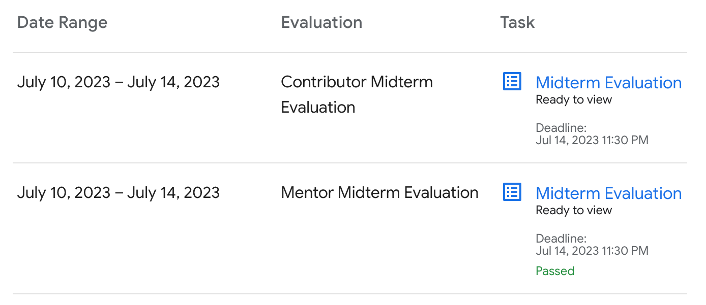

Hi, I have a great news about my Google Summer of Code Journey. I am glad to share that I have **passed** my Google Summer of Code Mid Evaluation.

Mid evaluation is not a hard one, indeed the questions asked in the GSoC Evaluation were not more than a feedback questions.

<h1 style="text-align: center"> 🎉    🥳 </h1>

I would like to express my heartfelt gratitude to my mentor, [Daniel](https://danigm.net), for his invaluable support and guidance since the inception of this project. I extend my deepest appreciation to Daniel for his contributions, which have greatly contributed to my professional growth and the achievements of this endeavor. Once again, thank you, Daniel.
